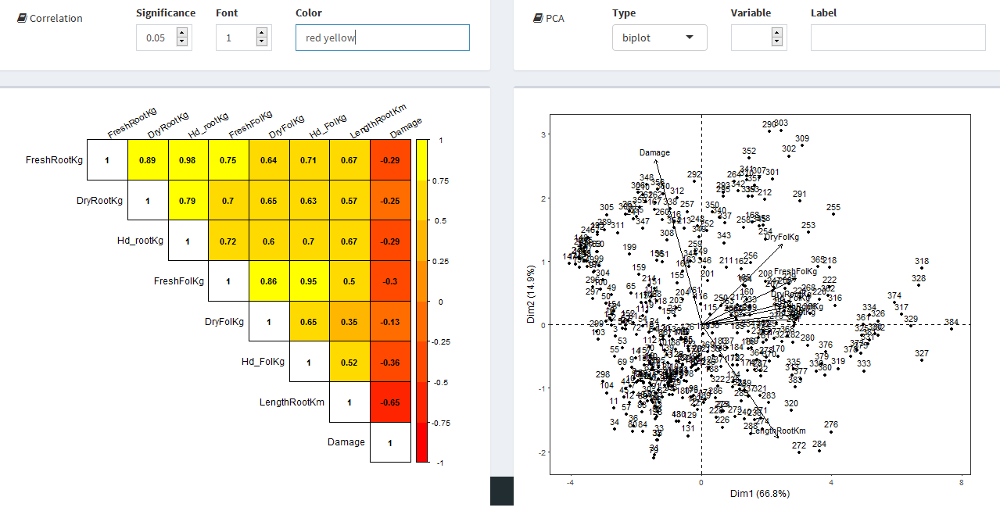
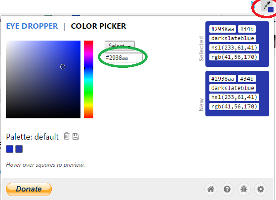
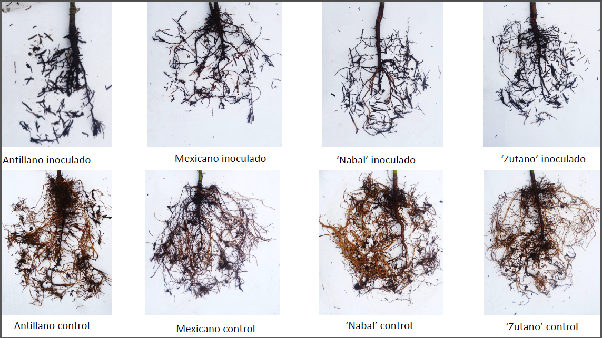
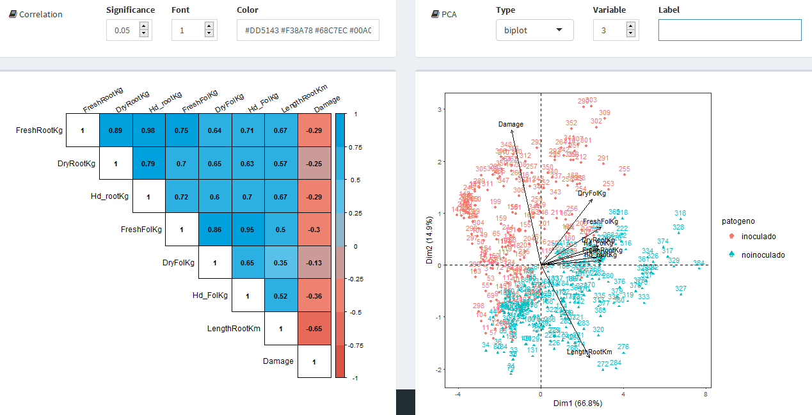
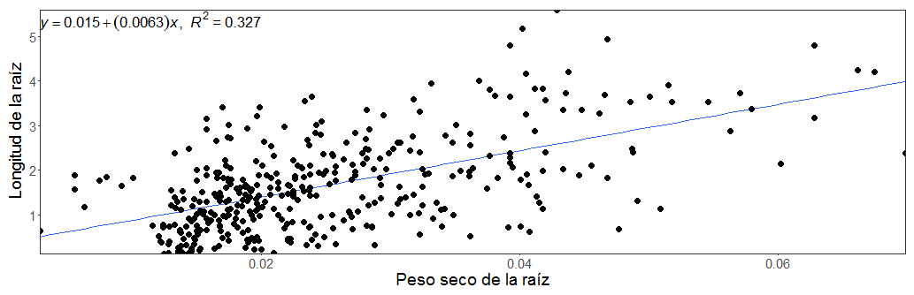
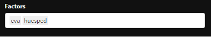
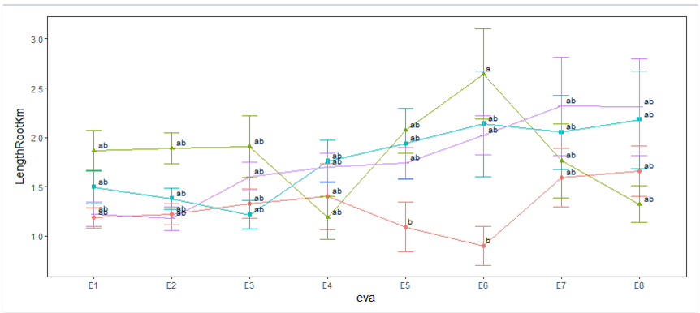

```{r setup, include=FALSE}
# source("cnfg/debug.r")
source("cnfg/setup.r")
# sheets_auth(T)
# url <- ""
# gs <- as_sheets_id(url)
# # browseURL(url)
# fb <- gs %>% 
#   sheets_read(sheet = "prosopis") 
```

# Yupana {-}

**_Yupana_** es una aplicación web (_online_) interactiva multiplataforma de interfaz amigable e intuitiva; que busca agilizar el desarrollo de investigación y validación de productos en las instituciones del sector agropecuario e industrial.

```{r, out.width='40%'}

```

## WebApp {-}

Yupana .: <https://flavjack.shinyapps.io/yupana/>

## User Manual {-}

<https://flavjack.github.io/yupana-usm>

## Como citar la app? {-}

Lozano-Isla, Flavio, Gomez Carrion, Jimmy, Benites-Alfaro, Omar, & De Mendiburu, Felipe (2018). Yupana: Herramienta web interactiva para el análisis de datos en la investigación agropecuario e industrial. Quipo. <www.quipolab.com>

# Caracteríticas

**_Yupana_** permite el análisis de datos cuantitativos en diferentes áreas de ciencias agropecuarias y en el sector agro industrial ( e.i. evaluar un nuevo producto químico, dosis de fertilización, evaluación de nuevas variedades, etc). La plataforma no solo permite el análisis de datos, también ayuda en el planteamiento del diseño experimental (libreta de campo), escogiendo le diseño a utilizar (DCA, DBCA, DCL), los factores y niveles del factor, el numero de repeticiones, el numero de evaluaciones que se realizarán y las variables que se desea evaluar durante la fase experimental. 

Construida la libreta de campo, esta se podrás exportarla e formato _.xlsx_ para la colecta de datos, siendo esta misma importada a la plataforma para su posterior análisis siguiendo un flujo de trabajo lógico donde vamos a poder visualizar en tiempo real la distribución de los  datos, el nivel de correlación, comparación de medias, y gráfica de los resultados.

Bienvenido al fascinante mundo de la innovación científica, nunca antes el poder de las estadísticas a han estado **a un clic de transformar los datos en conocimiento.**


# Modulos de la aplicación

La aplicación se divide en 9 modulos en los que nos permitiran generar el libro de campo, analisis multivariado, pruebas estadisticas y generación de gráficos. Los modulos se describen a continuación.


```{r}

mdl <- data.frame(stringsAsFactors=FALSE,
        "Modulo" = c("Welcome", 
                   "User manual", 
                   "FieldBook", 
                   "Import data",
                   "Exploratory graphic",
                   "Regression", 
                   "Multivariante",
                   "Statistics", 
                   "Graphics"),
        
   "Descripción" = c(
     
"Presentacion de la aplicación, sus principales características y como hacer la referencia bibliográfica de la plataforma.",

"Manual de usuario, paso a paso de como usar la plataforma.",

"Módulo para generar el libro de campo bajo los principales diseños experimentales (DCA, DBCA, DCL. factorial) para colecta de datos durante tu investigación.",

"Permite carga la base de datos (libreta de campo) en formato .xlsx o a través de una hoja de cálculo de google.",


"Permite la visualización de la distribución y simetría de tus datos mediante la construcción de diagramas de cajas o boxplot.",

"Construye modelos de regresión lineal simple con la visualización de la ecuación y representación gráfica.",

"Muestra de forma grafica los análisis multivariados de correlación de Pearson y en análisis de componentes principales (PCA).",

"Permite el análisis estadístico de las variables a través del análisis de varianza, prueba de comparación de medias, resúmen de datos como evaluar los supuestos estadísticos.",

"La visualización de los resultados en gráfico de barras o líneas de calidad científica, permitiendo modificar de acuerdo al requerimiento del usuario")

)


knitr::kable(
  mdl,
  booktabs = TRUE,
  caption = "Módulos de la aplicacion Yupana, para el análisis interactivo de datos."
  )

```


# FieldBook (libreta de campo)

FieldBook  construye libretas de campo, el cual sigue  un correcta estructuración de los datos para su posterior análisis, exportando la libreta en un estructura  que entienda el computador. Pero, ¿Qué son los datos estructurados?

##Datos estructurados

Nos referimos al arreglo que alberga todas las condiciones del diseño experimental, Y es el punto de partida para todo  análisis  que se pretenda realizar posteriormente, no prestar la debida atención a la correcta estructura  de los datos no solo demandaria mayor inversión de tiempo y dinero, sino el riego inminente de echar por tierra todo el ensayo.

Motivo por el cual los datos deben de ordenarse siguiendo las siguientes consideraciones desde el comienzo:

**1.- cada variable es una columna**,

**2.- cada obervación es una fila**, y

**3.- una unidad experimental por celda**.

Todas estas condiciones del trabajo  deben  ser estructuras en una única hoja, de la siguiente manera.


 A continuación, un ejemplo. Se realiza un experimento donde se desea saber el efecto de una enfermedad sobre  individuos de la misma especie pero diferentes cargas genéticas.

_Antillano_, 
_Mexicano_, 
_Nabal_, y 
_zutano_

Queremos saber como se comportan a la  enfermedad  "pudrición de raiz" causado por _P. cinnamomi_. Por tanto, para este factor tenemos dos sub-factores.

_inoculado_ y 
_noinoculado_

Los hospederos de dicha enfermedad tendrán la condiciones del invernadero y patógeno virulante. Se deses comparar como responden estos individuos a la enfermedad. Por tal razón el diseño estadístico sera un: 

  **Diseño completamente al azar con dos factores**

De dos factores: hospedero y patógeno. Ademas, debera de evaluarse en el tiempo (**8 evaluaciones**) para conocer el progreso de la enfermedad, tendra **6 repeticiones** en cada evaluación (*6 plantas de palto*) y la variable respuesta será:


      Weight fresh root (kg), .........FreshRootKg
      Weight dry root (Kg), ...........DryRootKg
      Weight humidity root (Kg), ......Hd_rootKg
      Weight fresh foliage (Kg), ......FreshFolKg
      Weight dry foliage (Kg), ........DryFolKg
      Weight humidity foliage (Kg), ...Hd_folKg
      Length root (Km), y..............LengthRootKm
      Damage root (%)..................Damage
      

Entoces, el libro de campo que se construya debe cumplir con el diseño que se va a ejecutar,  un Diseño completamente al azar con dos factores:

**factor Patogeno**: _inoculado_ y _noinoculado_; y el otro factor:
**factor Huesped**: _antillano_, _mexicano_, _zutano_ y _nabal_.

En la columna evaluación: se tiene a  _E1_ (evaluacion 1); y  encabezando la primera columna con la etiqueta _rep_  contiene a las repeticiones del diseño estadístico: _rep1_, _rep2_, _rep3_, _rep4_, _rep5_, _rep6_. ( _ver figura:_ FieldBook DCA-2factor)

Además, en las columnas "E" y "F" se ubican _las variables respuestas_: _FreshRootKg_ y _DryRootKg_, el cual contiene los datos recogidos de cada unidad experimental. ( _ver figura:_ FieldBook DCA-2factor)

Cada celda en la columna variable corresponde al dato recogido de una unidad experimental. En _azul_, el cual corresponde a la celda "E22", se leería de la siguiente manera: La repetición 3, del tratamiento (nabal-inoculado) de la evaluación número 1, de la variable FreshRootKg, el dato recogido es: *0.0351*.

De igual manera para la celda en _rojo_, el cual corresponde a la celda *F8*, se leería de la siguiente manera: La repetición 1, del tratamiento (mexicano-inoculado) de la evaluación 1, de la variable DryRootKg, el dato reogido es: *0.0168*.


A continuación, un ejemplo para un diseño completamente al azar, donde la evaluación en el tiempo  representado por la columna _intime_. En este diseño los tratamientos corresponden a una sola columna denominada para esta table _treatment_ ( T1, T2, T3, T4, T5), asi mismo las repeticiones corresponden a la columna _rep_ (R1, R2, R3, R4) y seguidamente las variables respuestas: n_turiones, peso_turiones, n_yemas y Kg_ha.


La lectura para cada celda con los datos datos serian de la misma manera, por ejemplo para *D2*:  La repetición 1, del tratamiento T1 de la evaluacion número 1, de la variable n_turiones, el dato recogido es: *90657.60*.

Es importante notar que ambas tablas alberga todas las características de los datos estructurados:

*1.- *cada variable es una columna,

*2.- *cada obervación es una fila, y

*3.- *una unidad experimental por celda.


##Diseño Experimental.

Fieldbook llama a la caja de dialogo *Experimental Design* para iniciar con la construcción y posterior exportación de la libreta de campo. En **Layout** elegimos el modo por defecto _standard_, seguidamente en la caja _Design_ tenemos un desplegable donde se debe elegir uno de los siguientes diseños estadísticos:

**Diseño completamente al Azar (DCA) / Completely randomized design (CRD)**

**Diseño completamente al azar (DBCA) / Randomized complete bock design (RCBD)**

**Diseño cuadrado latino (DCL) / Latin square design (LSD)**

**DCA con dos factores /Two-way factorial arrangement in completely randomized design**

**DBCA con dos factores / Two-way factorial arrangement in complete block design**


**Header** aquí se debe colocar el nombre del factor de variación, el cual se vizualizará en el alibreta de campo como la cabecera de la columna al que pertenece los niveles del factor (tratamientos).

**Factor levels** corresponde a los niveles del factor, al que corresponde el factor de variación, y van separado por comas.

**Variables** correponde a las variables respuestas del experimento, y tambien van separados por comas. Se recomienda como parte de las buenas practicas que esta no sea un frase o palabra larga pues asignaria por defecto una columna demasiado larga. 
Por ejemplo, si se desea tener tener como variable respuesta: "El peso seco de la espiga de maíz amarillo duro en miligramos", una asignación sería: *pe_AD*.

*recomendación:*
Adicionalmente se recomienda dejar anotada en una hoja adicional, la leyendas para la construcción de variables, como las unidades en las que serán medidas, la fecha, entre otras anotaciones que el responsable considere importante.


**Replications** Se recomienda tener un mínimo de tres repeticiones. A mayor repeticiones reducirmos el error tipo I.

**Intime** Corresponde a las evaluaciones que se hacen en el tiempo, por defecto figura uno, pero es normal que en un experimento se hagan muchas más evaluaciones sobre la unidad experimental.


A continuación, construiremos una libreta de campo (FieldBook) bajo un diseño en bloques completamente al azar (DBCA), con tres repeticiones, dos evaluaciones en el tiempo. para analizar tres tipos de fertilizantes (fertilizante A, fertilizante B y fertilizante C). Donde las variables respuestas serán: el peso,  altura y nfrutos.
 


_Cabe precisar que para fines prácticos en este diseño las repeticiones cumplen la función de organizar los bloques, pero conceptual y teoricamente son diferentes._

En la caja de **Vizualization** se muestra como se contruye la libreta de campo a la medida que se ingresan los requerimientos del diseño estadístico. Para seguidamente descargarlo en el formato de su preferencia: _csv_ ó _xlsx_.


Una libreta de campo constuida en FieldBook, además de exportar la libreta de campo randomizado, adiciona una columana denominada *ID*, el cual correspode al código de identificación de cada unidad experimenta. Por ejemplo, cuando hablamos del *U102* nos referimos al tratamiento tipo de fertilizante C del bloque1. Y según el diseño va a ser evaluada dos veces, E1 y E2.

A continuación queda colectar los datos en la variable respuesta que corresponda.


## Nota importante

Al ser esta una plataforma de soporte estadístico no deja de ser riguroso con la nomenclatura y símbolos raros. Evitar ingresar simbolos extraños que **No pertenezcan** al alfabeto ingles. Salvo en **label**,  el programa reconoce que haces referencia a un titulo, entonces los caracteres raros solo los imprimira, mas no los analizará. Por ejemplo

~~palto~~~~001~~     incorrecto (dos tratamientos)

~~pal?to%6""~~    incorrecto (evitar términos extraños, ???!"#$%&/()=??][{}[^)

palto_001     correcto    (un tratamiento)

Palto001      correcto   (un tratamiento)

**evitar tildes y "ñ"**

Aunque el programa soporta un mínimo de dos repeticiones, se recomienda al menos tener más de tres repeticiones. Siempre existe la posibilidad de pérdida de datos. En caso de ocurrir, mantener la plantilla tal cual y en la casilla donde corresponde el dato pérdido, dejar en blanco (nulo). No cero (0), puesto que es un valor diferente a nulo.


# Exploratory graphic

Aquí se visualizan los valores atípicos, y permite al investigador tomar desiciones, como realizar una transfomación de datos ó suprimir valores atípicos.

Para nuestro ejemplo, en **Response** seleccionar la variable respuesta del desplegable y al pie **Ylabel** escribiremos el rótulo del eje de la ordenadas, se coloca el rótulo de las ordenadas, el cual permite  notacion cientifica y  simbología no permitida siempre y cuando, vaya entre comillas (" "). 

Por ejemplo: **Damage ("%")**   imprimirá      **Damage (%)**

Con el mismo criterio escogeremos uno de los factores en **Axis X**. Para nuestro ejemplo deseamos mostrar en el eje de las abscisas los Huespedes de la enfermedad y sobre el plano cartesiano **(Grouped)** el _patogeno_ con sus dos subfactores: _inoculado_ y _noinoculado_.


    Amarillo: Elegir la varaible respuesta que desea visulizar y su rótulo.
    verde: Elegir el Tratamiento  a mostrar en el eje de la abscisas.
    rojo: Elegir el Tratamiento  a mostrar en el plano cartesiano.  
    Azul: Elegir la escala de los ejes y el tamaño de letra.  

Además en **Ylabel** y **Xlabel** permite escribir formulas como

  La formula del agua: **H[2] O  **
  
  La formula de kilómetros por hora: **km. Hr^{-1} **
  
  La concentracion de ácido sulfúrico:**"[" SO[4] .H[2] "]"**
  
  *IMPORTANTE: Terminado de escribir el rotulo NO dejar espacio en blanco.

Ahora, elegimos otra variable respuesta:

Del desplegable **response** elegimos _LengthRootKm_, **Axis X** elegimos _patogeno_ y finalmente **Grouped**, _huesped_, del mismo modo debemos de cambiar los _labels_ puesto que el la imagen aún no las hemos cambiado.


Otro forma de presentar la misma variable es la siguiente:


Finalmente debemos precisar que para estas imagenes, hay tres puntos rojos (flecha azul) estos son los datos fuera de tipo (outliers), el cual en consecuencia aumenta el coeficiente de variabilidad.


# Multivariate

En  **Multivariate** tenemos dos presentaciones de las variables respuestas. **Correlation** de Pearson y **PCA** (Ánalisis de componentes principales) ambos con sus respectivos gráficos. Estos nos permite conocer el grado de correlacion de las variables y el agrupamiento de los datos.



## correlation

En el cuadro de la izquierda **Correlation** de Pearson  muestra  el grado de **Significance**. Por defecto se trabaja con un grado de significancia igual al 5%, pero en el desplegable se puede elegir el nivel de significancia. 

La **Correlation**  permite conocer el grado de relacion que tiene cada variable respuesta respecto a la otra, en un rango de **+1 a -1**, si el valor absoluto de la correlación es cercano a **1** indica que presenta una _magnitud_ relación muy estrecha, y el signo es positivo o negativo indica que es una relación directa o inversa, respectivamente.


En **Font** se puede escoger el tamaño de fuente, el cual por defecto es **1** es el tamaño de fuente más apropiado si se desea copiar la imagen para imprimir. Por último, **color**, en este se colocaran los colores HTML de su preferencia separados por un espacio para representar dicha correlación, notar que el orden como se ingresan los códigos de colores HTML es importante. 


### colors HTML

Para un mejor empleo de los colores HTML en **Multivariate**, se debera colocasr los **colores HTML** o llamar a los  colores primarios por su nombre, como: 

_yellow_,  _red_,  _green_,  _blue_,  _orange_, _black_, _gray_, _white_. 

Una forma practica de obtener el código de color HTLM es usando un **eyes dropper**, una vez instalado en su navegador, ingresar al **color picker**. Copiar el cÓdigo del color como señala el elipse.




Copiado el codigo de color HTML, pegar en **Multivariate - correlation - color**.

Es asi como puede personalizar sus graficos de la **Correlation**.


## Analisis de componentes principales

En el analisis de los componentes principales (PCA), se tiene el desplegable **Type** donde se presenta _biplot_, _var_ e _ind_; y junto a **Variable**, se puede escoger el plano que mejor grafique el proposito, ó la combinacion de estos.

**PCA- Type** permite encoger _var_  el que representa la correlacion de las variables respuestas en una grafica simple  de radio = **1**. El cual tienen el mismo marco conceptual que **Correlation** visto lineas arribas, pero en  representación grafica y la variable de agrupamiento.

La variable respuestas poseen una _magnitud_ y _direccion_ respecto a los cuadrantes del plano cartesiano.

    Para el ejemplo observamos que se mueven una dirección opuesta (relacion inversa) y magnitud cercano a cercana a "1" (una correlaciin alta) entre Damage y LengthRootKm. Al investigador le interesan particularmente estas dos variables, puesto se esta estudiando la damage que causa un patogeno a las raices, es prioritario centrar su atención sobre los sintomas primarios (el deterioro de la raices).  



En el item  **FieldBook** se construyó la libreta de campo y el orden como se contruye la columna: repetición, bloque, factores y variables, es importante a la hora de escoger en   **Multivariate - PCA - Variable**,la columna que va a representar.

    Para el ejemplo, cuando elige la varible 2, elige la columna 2, que representa a las evaluaciones por lo que en la leyenda irá las evaluaciones con su respectivo color, y en label, tiene la oportunidad de cambiar el rótulo de la columna, puede cambiar eva  por Evaluación, por ejemplo.


     <El análisis de componentes principales suele ser muy utilizanda cuando se desea relacionar la presencia de un especie de cuerdo al habitat, por poner un ejemplo>



El eje de las componentes principales representa el _porcentaje de variabilidad de la varianza_ y no tiene otro significado del que le da el investigador.

# Regression

En regresión se puede construir modelos de regresion lineal simple, en **Variable** seleccionar la variable respuesta en la caja azul y verde, para el eje de las ordenadas y abscisas respectivamente.

Al pie de cada caja se encuentra la casilla **Label** el cual se encuentran vacias, pero allí se le puede cambiar el rótulo al eje, pues de no modificarlo tomará el nombre de la columna con el que fue cargada la libreta de campo.

En **Brakes** se trata de la segmentación de los ejes, y la mecánica es la misma mostrada en la construcción del _itm_ **Outliers**.


despues de igresada las variables se contruye la gráfica de regresión linealla ecuación y el coeficiente de correlación  de Pearson. 



Note además que los cambios realizados en **lavel** han modificado el nombre a los ejes, cambiando los nombre originales por _Longitud de la raíz_ para el eje de la ordenadas y Peso _seco de la raíz_.


En la caja  **Grouped** define el factor que se va a grupar en la contrucción de la ecuación lineal, para el ejemplo selccionamos el factor Huesped, en el que se tienes 4 subniveles. Entonces se graficarán 4 rectas, pero notar la la ecuación representa la recta promedio de esos cuatro subniveles.

Al pie de la caja roja se ubica **Legend** el que cambiar  el  nombre a la leyenda, el cual representa por defecto el nombre de la columna (el factor) con el que se contruyó la libreta de campo. Junto se ubica  **Levels** ambos puedes modificcar los nombre de los subniveles del factor seleccionado.

La consideración que debe tener para modificar **Levels** es que para modificar los nombre solo basta hacer dos espacios con la barra espaciadora para saltar al otro subnivel.

Para el ejemplo se ha cambido el rótulo por defecto por _cinnamomi_ y los subniveles por _g1_  _g2_  _g3_  _g4_


Note además que tanto en las cajas de color verde y azul se han modificado los rótulos de los ejes, con la unidades respectivas, si se desea ingresar simbología extraña, visitar _itm_ **Outliers**.


En la caja de exportación, encuentras:

**Size**  Modifica el tamaño de fuente, por defecto 2, pero se recomiendo descargar la imagen en fuente Size 1.

**Color** Modifica el color que va tener la figura, a colores ó en blanco y negro.

**Legend** Modifica la ubicación de la leyenda, 
        _none_: sin leyenda, 
        _left_: izquierda.
        _right_: derecha.
        _top_: arriba.
        _bottom_: abajo.

**Eq.x** Modifica la ubicación de la ecuación lineal en el  eje de la abscisas.
**Eq.y** Modifica la ubicación de la ecuación lineal en el  eje de la ordenadas.

Ambos pares ordendados (**Eq.x**,**Eq.y**) señalan donde se ubicará la ecuación lienal en el plano.

**height** Modifica la altura de la figura.

**weight** Modifica lo ancho de la figura.

**TIF(300dip)** Es el formato en el que se descarga la figura, es el formato **TIF**  el que se requiere para las publicaciones académicas.


# Statistic

Esta es un plataforma de calculos estadistístico, reposa sobre el investigador su correcto uso.

En **Response** seleccionamos la variable respuesta que deseamos analizar.

En **Block** dependiendo del diseño estadístico seleccionar el bloque, o del criterio del investigador alguna columna que quiera aislar de manera particular.

En **Factors** seleccionar el los tratamientos o factores.

En **Significance** esta predefinido con un nivel de significancia del 5%, pero este también queda a criterio del investigador.

En **Type** se presenta el tipo de prueba: _Tukey_, _Duncan_ y _Snk (Student Newman Keuls)_


Para nuestro ejemplo, segun la prueba de Tukey, existen diferencias estadisticamente significativas, entre evaluaciones, entre huespedes (individuos evaluados), y entre el factor patogeno (inoculado y noinoculado).
Y, No existe diferencias estadisticamente significativas cuando interatuan los factores (huesped:patogeno). Es decir, cuando se tomo cada bloque (cada evaluacion) no existe una respuesta significativa de los  hospederos  con respecto a la presencia o ausenica del patogeno. 
Cuando se evaluo la interacción, No se encontro evidencias estadisticamente significativas. Y esto, resulta beneficioso, pues de ser significativo se hubiera negado la validez de los factores analizados.

En en el cuadro adjunto, se los principales parametros y sus niveles de significancia, donde puede copiar, o descargar en formato csv o xlsx para poder hacer las graficas en el programa de su preferencia.


En la plataforma FieldBook tambien te permite relizar las graficas mas importantes, de lineas e histogramas para representar tu analisis de comparación de medias.

# Graphics

En la herramienta **Graphics** te permite traer de **Stadistic** lo analizado para representarlo graficamente. Aqui las herramientas:
  
  _Ylabel_,  _Xlabel_, y _Legend_ te permitirá dar forma a los rotulos de tus ejes de ordenadas, abscisas y leyenda respectivamente; manteniendo los mismos criterios de escritura vistas en el capitulo **Outliers** para la construcción de los rotulos.

Si se desea mantenerlos en blanco, arrastrará la informacion de las cabeceras con el que se contruyo en **tools** la libreta de campo.


Al pie de cada cuadro en azul, verde y rojo, tenemos _brakes_. En azul para definir el punto de partida del eje de las ordenas, el cual solo se habilita con el grafico de lineas. 

En _brake text_ permite modificar el los rotulos de los subfactores, dando dos espacios entre cada nombre del subfactor.

Del ejemplo, se desea cambiar:
  "inoculado"  y "noinoculado",por: enfermo  sano
es decir: enfermo(._._)sano

Y para los niveles de huesped (Legend): "Antillano", "Mexicano", "Nabal", y "Zutano", se desea cambiar por:
  G1  G2  g3 g4
es decir: 
  G1(._._)G2(._._)g3(._._)g4
*._ es la representacion grafica de un pulso sobre la barra espaciadora de l teclado. Si solo se da un solo espacio(._)        No saltara a cambiar el nombre del otro subnivel,  y por defecto imprimira "N.A".


Note como el orden en el que se ingresan los factores en **Stadistic** es importante. Para cambiar el orden de los factores debe de regresar a **Stadistic** y seleccionar primero a factor que se quiere representar en el eje de la abscisas (huesped) y luego el otro factor representado como grafico de barras (patogeno).  El primer factor siempre refleja el eje de las abscisas.


El siguiente grafico refleja  mejor el comportamiento de los individuos evaluados a la variable longitud de raiz. Esta grafica mejor el proposito del investigador, el cual es distinguir el comportamiento de los individuos. 


Las modificaciones a los rotulos se hace del mismo modo que en el capitulo **Outliers**. La caja de herraminetas que se muestra al lado izquierdo permite:
  
  **Size:** El tamano por defecto es **2**, se recomienda descargarlo en **1** para una mejor resolucion en la impresion.

**Type:** Se presentan dos tipos de graficos de _lineas_ y de _barras_. Cuando seleccionas _line_ puedes hacer uso en  *Ylabel* las funciones  *Limit(i)* y *Limit(f)* para modificar el eje de la ordenadas.

**Color:** Se muestra la graficas en blanco y negro, y a color.

**Significance:** Muestra la significancia representada por letras. 

**Error:**  Mostrar la barra de error.

**Lenged:** Muestra la ubicación del rotulo de la leyenda, _none_, _left_, _rigth_, _top_ y _bottom_.

**Heigth(mm)** y **Width(mm):** Es la altura y el ancho de la figura a imprimir.

**TIFF(300ppi):** Es el formato (del grafico) requerido para la divulgacion cientifica.


Se recalca una vez mas, el buen juicio del investigador. Para este ejemplo, es importante tener la representación grafica de la todas la evaluaciones en el tiempo y como se comportan los individuos con el patogeno (_inoculado_ y _noinoculado_), 

Entonce, deberemos volver a **Stadistic**, y el primer factor que se debe ingresar es: evaluaciones seguido de los individuos evaluados (_huesped_), como se muestra a continuacion:
  
  

Seleccionamos el **graphic** - **Type** - **line**  para una representación con grafico de lineas, vale señalar que la grafica se ha construido sobre el promedio de factor **patogeno**.



Si se desea hacer un disgregación más minusiosa, podemos usar la herramienta **Filter** de **FieldBook** y seleccionar en filtro el factor *patogeno* y como subfactor *inoculado* para su analisis y represenación grafica, como se muestra a continuación.


